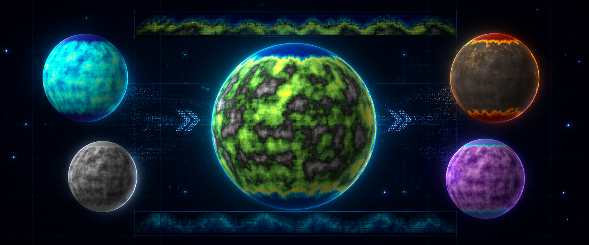
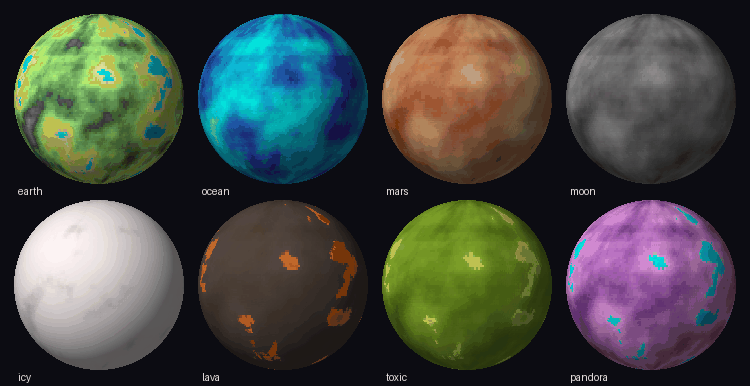
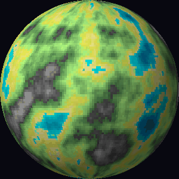

<p align="center">
  
</p>

<h1 align="center">2D Planet Generator</h1>

<p align="center">
  <strong>一个 seed → 高度图、世界地图、带光照球体和循环 GIF。</strong><br>
  为游戏、原型、绘画流程和程序化世界实验准备的轻量无界面星球工厂。
</p>

<p align="center">
  <a href="README.md">English</a> ·
  <a href="LICENSE"></a>
  
  
</p>

## 把一个 JSON 配方变成一颗星球

当你需要**可复现的星球素材，但不想安装编辑器、游戏引擎或图形运行时**时，就使用
2D Planet Generator。用 JSON 描述地形，选择一个 seed，然后输出可复用数据或成品图。

```bash
python main.py all \
  --schema schemas/default.gen.json \
  --config schemas/default.render.json \
  --out-data planet.json \
  --out-png planet.png
```

同一个 `planet.json` 可以反复更换配色、投影、尺寸、光照与旋转角度。地形生成与视觉
表现始终分离。

## 谁会需要它？

| 你是…… | 你需要…… | planetgen 能提供…… |
| --- | --- | --- |
| 独立游戏开发者 | 世界地图、选关界面、卡牌或背景里的星球 | 可复现的 PNG 球体与循环 GIF |
| 程序化生成爱好者 | 不搭引擎就能快速试验地形 | 用 JSON 控制、由 seed 驱动的 Perlin 高度图 |
| 2D 或像素画师 | 可以继续加工、重绘或换色的底图 | 平面地图、带光照球体和 17 种配色 |
| 工具或流水线开发者 | 在脚本、服务器或 CI 中批量生成素材 | 只依赖 NumPy 与 Pillow 的无界面 CLI |
| 教师或学习者 | 一个紧凑的“噪声 → 数据 → 投影”案例 | 不依赖噪声库、模块清晰的 Python 源码 |

如果你需要物理准确的球面模拟、交互编辑、云层与大气、生物群落或真实陨石坑，请选择
别的工具。本项目有意保持为一个小而清晰的地形生成与渲染器。

## 它能做出什么？

<p align="center">
  
</p>

- 与显示方式无关、可接入自有游戏或渲染器的 JSON 高度图。
- 经度方向无缝、适合贴球的 2:1 平面世界地图。
- 透明或纯色背景、带简单光照的星球图。
- 首尾无缝、无限循环的自转 GIF。
- 用同一份地形生成类地、海洋、熔岩、月球、冰冻、剧毒和异星等风格。

<p align="center">
  
</p>

## 30 秒开始

需要 Python 3.10 或更高版本。

```bash
git clone https://github.com/clingsz/2d-planet-generator.git
cd 2d-planet-generator
python3 -m venv .venv
source .venv/bin/activate
pip install -r requirements.txt

# 生成地形数据与一张带光照的球体图。
python main.py all \
  --schema schemas/default.gen.json \
  --config schemas/default.render.json \
  --out-data planet.json \
  --out-png planet.png

# 把同一份地形变成约六秒循环一周的动画。
python main.py gif \
  --data planet.json \
  --config schemas/default.render.json \
  --out planet.gif \
  --frames 72 \
  --fps 12
```

`--schema` 和 `--config` 都可以省略；省略后使用程序内置默认值。

## 按你想要的结果选择任务

| 目标 | 操作 | 输出 |
| --- | --- | --- |
| 创建新世界的地形 | 修改 `seed`，运行 `generate` | `planet.json` |
| 得到可以直接使用的星球图 | 用球体配置运行 `all` | `planet.json` + `planet.png` |
| 制作循环动画 | 对已有星球运行 `gif` | `planet.gif` |
| 制作平面地图或纹理 | 把 `projection` 设为 `flat`，运行 `render` | 矩形 PNG |
| 给同一个世界换主题 | 只修改 `colormap`，再次运行 `render` | 地形相同、风格不同的新图 |
| 批量生成可复现变体 | 用不同 schema 或 seed 重复调用 CLI | 适合自动化流水线的确定性素材 |

## 心智模型

```text
生成 schema (JSON)
        │
        ▼
     generate ─────────────▶ planet.json
                               高度图数据
                                   │
                     显示配置      │
                           ┌───────┴────────┐
                           ▼                ▼
                       平面 / 球体        自转动画
                           │                │
                           ▼                ▼
                          PNG              GIF
```

核心只有一句：**地形是数据，画面只是这份数据的一种视图。**

## 任务配方

### 1. 生成一颗不同的星球

修改 `schemas/default.gen.json` 里的 `seed`，然后运行：

```bash
python main.py generate \
  --schema schemas/default.gen.json \
  --out planet.json
```

同一个 schema 加同一个 seed 永远会生成相同地形。

### 2. 把同一颗星球渲染成多种风格

保留 `planet.json`，只修改显示配置里的 `colormap`，再渲染一次：

```bash
python main.py render \
  --data planet.json \
  --config schemas/default.render.json \
  --out planet-earth.png
```

可以试试 `earth`、`ocean`、`moon`、`lava`、`icy` 或 `pandora`，无需重新生成地形。

### 3. 制作游戏可用的平面地图

准备这样的显示配置：

```json
{
  "colormap": "earth",
  "projection": "flat",
  "scale": 4
}
```

然后渲染：

```bash
python main.py render \
  --data planet.json \
  --config flat.render.json \
  --out planet-map.png
```

### 4. 导出无缝自转动画

```bash
python main.py gif \
  --data planet.json \
  --config schemas/default.render.json \
  --out planet.gif \
  --frames 72 \
  --fps 12
```

帧数越多，动画越流畅、文件也越大。转速为 `360 / frames × fps` 度/秒。经度方向默认
循环采样，因此动画不会出现地图接缝。

## 生成输入

所有生成字段均可省略：

```jsonc
{
  "name": "default",
  "size": [200, 100],          // [宽, 高]；2:1 最适合贴到球体
  "seed": 1,                   // 修改它会生成另一个世界
  "noise": {
    "scale": 30.0,             // 越大越平滑、地貌越宽阔
    "octaves": 4,              // 细节层数
    "persistence": 0.5,        // 每层保留的振幅
    "lacunarity": 2.0,         // 每层增加的频率
    "offset": [0, 0],
    "wrap_x": true             // 左右边缘无缝衔接
  },
  "shaping": {
    "normalize_mode": "global", // "global"、"local" 或 "none"
    "flood": 0.0,              // 负数增加海洋，正数增加陆地
    "falloff": false,          // 压低外缘，形成海岛
    "elevate_horizontal": null,
    "elevate_vertical": null
  }
}
```

### 地形调参速查

| 想要的结果 | 调整方式 |
| --- | --- |
| 更细碎、更丰富的细节 | 增加 `octaves`，减小 `scale` |
| 更平滑、更大块的地貌 | 减少 `octaves`，增大 `scale` |
| 更强的海拔对比 | 增大 `persistence`，例如 `0.6`–`0.7` |
| 更多海洋 / 更多陆地 | 减小 / 增大 `flood` |
| 海岛形地形 | 把 `falloff` 设为 `true` |
| 完全不同的世界 | 修改 `seed` |

### 归一化模式

| 模式 | 行为 | 适合场景 |
| --- | --- | --- |
| `global` | 相对于噪声理论振幅保留海拔，使配色中定义的海平面仍有意义 | 区分海洋星、沙漠星与干旱星；推荐默认值 |
| `local` | 把每张地图自身的最小值和最大值拉伸到完整范围 | 强制任意地形用满整条配色 |
| `none` | 不对塑形后的噪声归一化 | 调试与自定义数据管线 |

## 显示输入

```jsonc
{
  "colormap": "terrain",
  "projection": "sphere",     // "sphere" 球体或 "flat" 平面
  "scale": 4,                  // 平面图的最近邻放大倍数
  "radius": 256,               // 球体半径（像素）
  "rotation": 0.0,             // 经度旋转角度
  "shading": true,
  "background": [0, 0, 0, 0]  // RGBA；默认透明
}
```

可用配色：

```text
earth (terrain), moon, mars, ashy, lava, volcano, gobi, venus,
toxic, redstone, ocean, pandora, icy, dessert, tempest, hive, grayscale
```

在 `colormaps.py` 中定义一条新渐变即可增加配色。

## 输出约定

`planet.json` 与任何显示方式无关，也很容易接入其他工具：

```jsonc
{
  "meta": {
    "name": "...",
    "size": [200, 100],
    "seed": 1,
    "schema": {}
  },
  "heightmap": [[0.0, 0.1], [0.2, 0.3]] // 按 [x][y] 存储
}
```

## 项目地图

| 路径 | 职责 |
| --- | --- |
| `noise.py` | 向量化分形 Perlin 噪声 |
| `shaping.py` | 归一化、海平面、falloff 与方向性塑形 |
| `colormaps.py` | 命名星球渐变与高度到颜色的映射 |
| `generate.py` | 生成 schema → 可复用高度图数据 |
| `render.py` | 高度图数据 → 平面图、球体或动画帧 |
| `main.py` | 命令行入口 |
| `schemas/` | 可以直接修改的生成与显示配方 |
| `gallery/` | 项目实际生成的图片与 GIF |

## 当前边界

- 经度方向已经无缝，但两极仍可能挤压；原因是噪声采样自等距柱状地图，而不是直接在
  球面采样。
- 当前地形只使用分形噪声，还没有专门的陨石坑、生物群落、云层或大气生成器。

## 开源许可证

本项目采用 [MIT License](LICENSE) 开源。去创造一颗星球吧。
